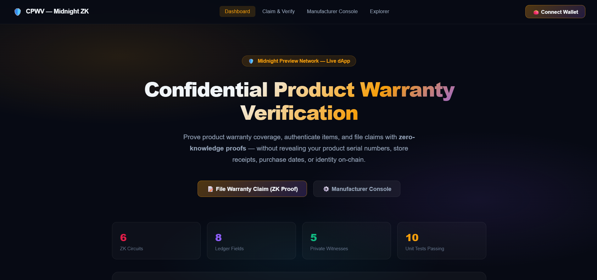
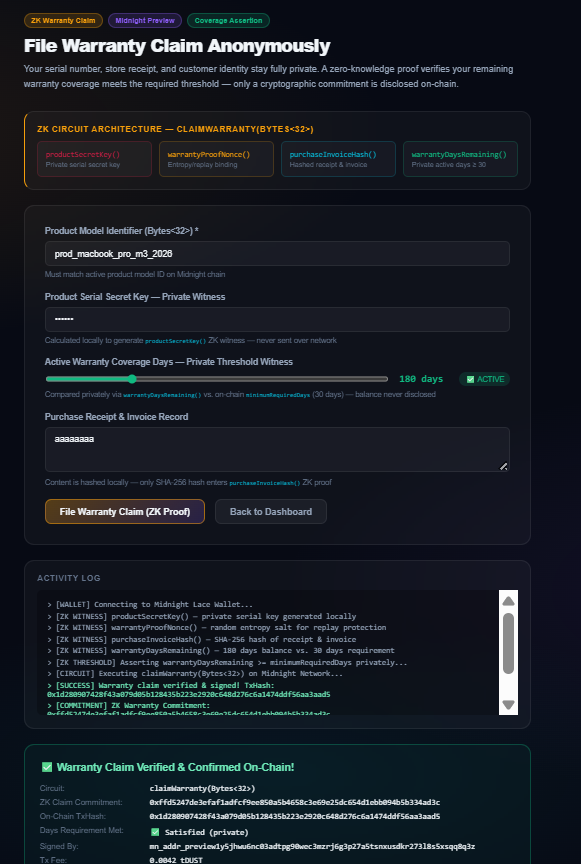
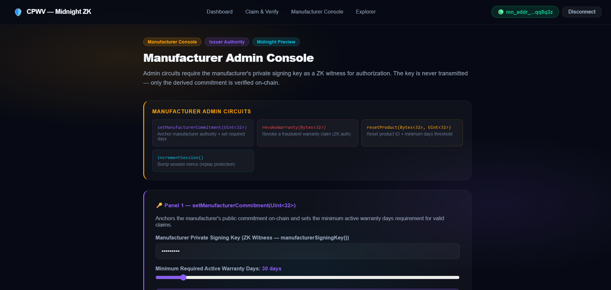
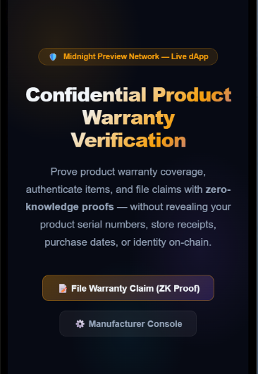

# Anonymous Mental Health Survey (AMHS)
> **Privacy-Preserving Zero-Knowledge Mental Health Assessment & Clinical Research Protocol on Midnight Network**

[](https://github.com/tech-master-guru/Anonymous-Mental-Health-Survey)
[](https://preview.midnightexplorer.com/contracts/0x2bf4b77c96faf17a985b45b11436edf3538bf6ba287cfbdefd592c571819d897)
[](https://preview.midnightexplorer.com/contracts/0x2bf4b77c96faf17a985b45b11436edf3538bf6ba287cfbdefd592c571819d897)
[](https://github.com/tech-master-guru/Anonymous-Mental-Health-Survey)
[](./LICENSE)

---

## Executive Overview

Mental health assessments and clinical psychological research require high degrees of honesty, yet participants consistently self-censor or avoid participation out of fear of social stigma, employer surveillance, insurance discrimination, or data breaches. Centralized survey databases accumulate sensitive psychiatric indicators tied to IP addresses, emails, and device fingerprints.

**Anonymous Mental Health Survey (AMHS)** solves this fundamental dilemma by implementing a zero-knowledge confidential survey protocol built on the **Midnight Network**. Using Midnight's **Compact** smart contract language, participants prove their survey eligibility and submit cryptographically valid responses without revealing their participant secret key, personal identity, or sensitive raw answers to anyone—including the researchers and the public ledger.

---

## Live Deployed Contract

The AMHS smart contract is compiled, deployed, and actively verified on the **Midnight Preview Testnet**:

| Parameter | Authoritative Value |
|---|---|
| **Network** | Midnight Preview Testnet |
| **Contract Address** | `0x2bf4b77c96faf17a985b45b11436edf3538bf6ba287cfbdefd592c571819d897` |
| **Explorer URL** | [View on Midnight Preview Explorer](https://preview.midnightexplorer.com/contracts/0x2bf4b77c96faf17a985b45b11436edf3538bf6ba287cfbdefd592c571819d897) |
| **Public Indexer** | `https://indexer.preview.midnight.network/api/v4/graphql` |
| **Proof Server** | `https://proving.preview.midnight.network` |

---

## Architectural Highlights

```
┌─────────────────────────────────────────────────────────────────────────────┐
│                    ANONYMOUS PARTICIPANT (CLIENT-SIDE)                      │
│                                                                             │
│  [Participant Secret Key]  [Survey Nonce]  [Encrypted Response]  [Score]   │
│           │                     │                  │                │       │
│           └─────────────────────┼──────────────────┴────────────────┘       │
│                                 ▼                                           │
│                 Midnight.js ZK Proof Generator                              │
│              (Compact Circuit: submitSurveyResponse)                        │
└─────────────────────────────────┬───────────────────────────────────────────┘
                                  │ Zero-Knowledge Proof + Public Commitment
                                  ▼
┌─────────────────────────────────────────────────────────────────────────────┐
│                    MIDNIGHT NETWORK (ON-CHAIN LEDGER)                       │
│                                                                             │
│  • Public Ledger State:                                                     │
│    ├── submissionCount        : Total valid anonymous submissions           │
│    ├── revokedCount           : Total participant-retracted submissions     │
│    ├── activeSession          : Replay protection session counter           │
│    ├── cohortId               : Active clinical study cohort identifier     │
│    ├── surveyorCommitment     : Surveyor cryptographic authority root       │
│    ├── lastSubmissionCommitment: Most recent verified submission hash       │
│    └── minimumScoreThreshold  : Minimum qualifying clinical assessment score│
└─────────────────────────────────────────────────────────────────────────────┘
```

---

## Compact Smart Contract Circuits

The contract (`contracts/anonymous_mental_health_survey.compact`) exposes 6 verifiable circuits with 5 private witnesses:

### 1. Circuits (`export ledger`)
- `submitSurveyResponse(expectedCohortId: Bytes<32>): Bytes<32>`
  Participant submits an anonymous survey response. Proves knowledge of valid participant secret key, cohort affiliation, and assessment score exceeding minimum threshold without revealing raw responses.
- `verifySurveySubmission(claimedCommitment: Bytes<32>): Boolean`
  Publicly checks if a specific survey response commitment has been incorporated into the ledger.
- `revokeSubmission(commitmentToRevoke: Bytes<32>): Bytes<32>`
  Allows a participant to revoke or retract their survey submission using their blinding nonce.
- `setSurveyorCommitment(newThreshold: Uint<32>): Bytes<32>`
  Clinical surveyor updates or rotates the active commitment and threshold requirements.
- `resetSurveyCohort(newCohortId: Bytes<32>, newThreshold: Uint<32>): Bytes<32>`
  Survey administrator rotates the active cohort group and updates qualifying criteria.
- `incrementSession(): []`
  Advances the session counter to guarantee global anti-replay protection.

### 2. Private Witnesses (`witness`)
- `participantSecretKey(): Bytes<32>`: Private participant salt and identity credential.
- `surveyProofNonce(): Bytes<32>`: Ephemeral one-time blinding nonce ensuring submission untraceability.
- `surveyResponseDataHash(): Bytes<32>`: Cryptographic hash of encrypted response vector.
- `assessmentScoreValue(): Uint<32>`: Participant's clinical score verified against threshold.
- `surveyorSigningKey(): Bytes<32>`: Clinical administrator signing authority credential.

---

## Application Screenshots

### 1. Main Dashboard & System Overview

*Real-time AMHS dashboard monitoring active cohort, total anonymous submissions, and Midnight Preview ledger metrics.*

### 2. Anonymous Survey Submission Portal

*Zero-knowledge survey submission form with client-side witness commitment generation and Midnight Lace wallet integration.*

### 3. Surveyor Clinical Admin Console

*Surveyor administrator interface for rotating study cohort IDs, adjusting qualifying score thresholds, and monitoring revocations.*

### 4. Responsive Mobile Experience

*Mobile-first design ensuring anonymous surveys can be completed discreetly on any smartphone.*

### 5. Verified Test Suite Execution

*All 13 unit and integration tests passing successfully against the AMHS contract runtime.*

---

## Project Structure

```
Anonymous-Mental-Health-Survey/
├── contracts/
│   ├── anonymous_mental_health_survey.compact   # Authoritative AMHS Compact contract
│   └── counter.compact                         # Counter circuit baseline
├── managed/
│   ├── compiler/
│   │   └── contract-info.json                  # Circuit, witness & ledger metadata
│   ├── contract/
│   │   ├── index.cjs                           # CommonJS runtime bindings
│   │   ├── index.d.ts                          # TypeScript ledger & circuit types
│   │   └── index.js                            # ESModule runtime bindings
│   ├── keys/                                   # Proving & verifying key definitions
│   └── zkir/                                   # ZKIR intermediate representations
├── photos/                                     # High-resolution application screenshots
├── public/                                     # Static public web assets
├── scripts/
│   ├── compile-compact.mjs                     # Compact compiler runner
│   ├── deploy.ts                               # Authoritative Midnight deploy script
│   └── deploy-runner.mjs                       # Standalone deployment runner
├── src/
│   ├── app/
│   │   ├── admin/page.tsx                      # Surveyor clinical administration console
│   │   ├── claim/page.tsx                      # Participant anonymous survey portal
│   │   ├── explorer/page.tsx                   # Real-time Midnight Preview ledger explorer
│   │   ├── layout.tsx                          # App shell, fonts & meta tags
│   │   └── page.tsx                            # Hero landing page & architectural breakdown
│   ├── components/
│   │   └── Navbar.tsx                          # Navigation bar with wallet status
│   ├── integration/
│   │   ├── contract.ts                         # Midnight contract interface & client
│   │   └── deploy.ts                           # SDK deployment helper
│   └── lib/
│       └── contract.ts                         # Client SDK, Lace wallet adapter & GraphQL client
├── tests/
│   └── counter.test.ts                         # 13 comprehensive Vitest tests
├── package.json                                # Project dependencies & scripts
├── tsconfig.json                               # Strict TypeScript configuration
└── vitest.config.ts                            # Vitest test configuration
```

---

## Setup & Local Development Guide

### Prerequisites
- **Node.js**: `>= 20.0.0` (Recommended: `v22.x`)
- **npm**: `>= 10.0.0`
- **Midnight Lace Wallet** (Chrome Extension for browser testing)

### 1. Clone the Repository
```bash
git clone https://github.com/tech-master-guru/Anonymous-Mental-Health-Survey.git
cd Anonymous-Mental-Health-Survey
```

### 2. Install Dependencies
```bash
npm install
```

### 3. Compile Compact Smart Contracts
Compile the `.compact` smart contracts and regenerate runtime bindings:
```bash
npm run compile:compact
```

### 4. Run Test Suite
Execute the 13 automated tests covering circuit execution, witnesses, and ledger operations:
```bash
npm test
```

### 5. Launch Development Server
Start the local Next.js development server:
```bash
npm run dev
```
Visit `http://localhost:3000` in your browser.

### 6. Create Production Build
Verify production compilation and static page generation:
```bash
npm run build
npm start
```

---

## Author & Contributor

- **Author**: `tech-master-guru`
- **Email**: `shuvamdutta596@gmail.com`
- **Repository**: [https://github.com/tech-master-guru/Anonymous-Mental-Health-Survey](https://github.com/tech-master-guru/Anonymous-Mental-Health-Survey)

---

## License

This project is licensed under the MIT License. See [LICENSE](./LICENSE) for details.
