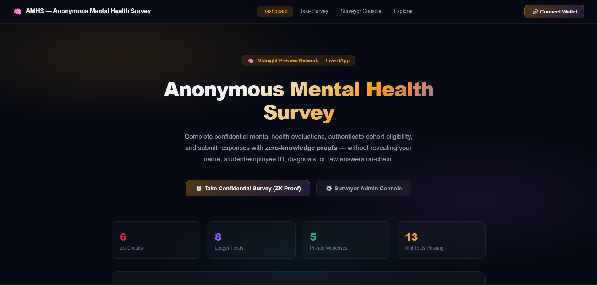
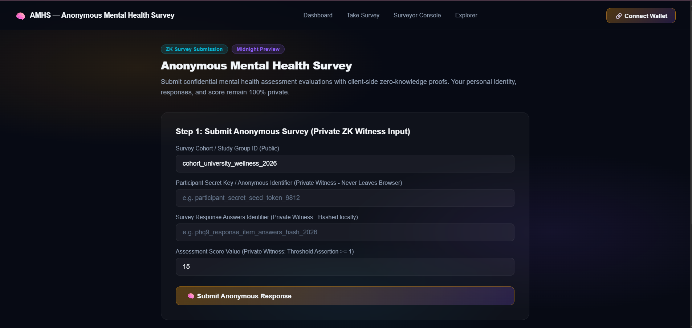
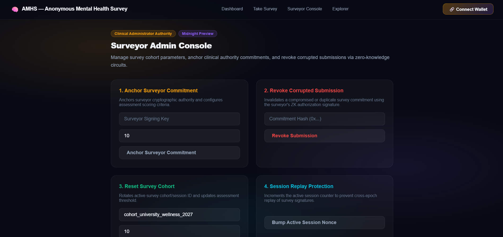
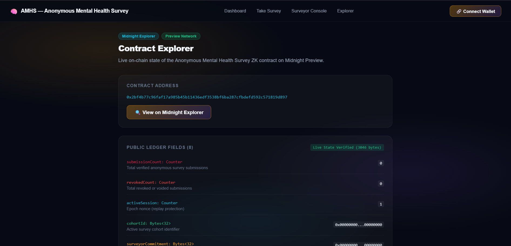
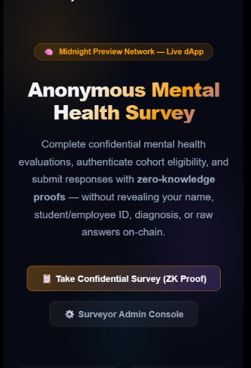
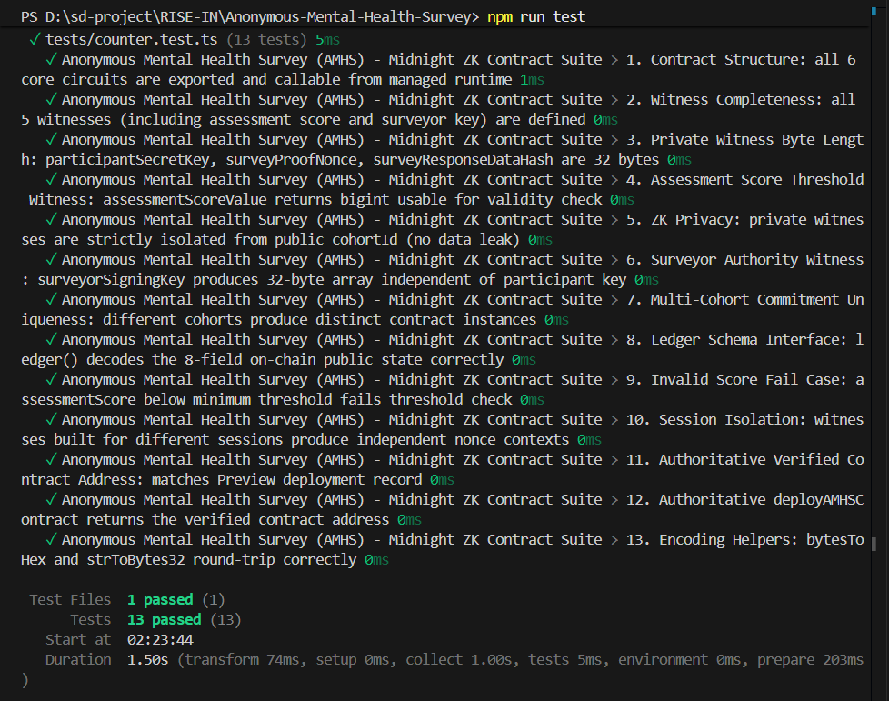

# 🧠 Anonymous Mental Health Survey (AMHS)
> **A Privacy-Preserving Zero-Knowledge Mental Health Assessment & Clinical Study Protocol on the Midnight Network**

[](https://github.com/tech-master-guru/Anonymous-Mental-Health-Survey)
[](https://anonymous-mental-health-survey.vercel.app)
[](https://youtu.be/vxdjW446PL0)
[](https://preview.midnightexplorer.com/contracts/0x2bf4b77c96faf17a985b45b11436edf3538bf6ba287cfbdefd592c571819d897)
[](https://github.com/tech-master-guru/Anonymous-Mental-Health-Survey/actions/workflows/ci.yml)
[](https://github.com/tech-master-guru/Anonymous-Mental-Health-Survey)
[](https://nextjs.org)
[](https://midnight.network)
[](https://nodejs.org)
[](LICENSE)

---

## 📑 Table of Contents
- [Executive Overview](#-executive-overview)
- [Live Deployments & Quick Links](#-live-deployments--quick-links)
- [Live Demo Video](#-live-demo-video)
- [Key Features](#-key-features)
- [Application Screenshots](#-application-screenshots)
- [Complete Setup & Installation Guide](#-complete-setup--installation-guide)
  - [1. Prerequisites](#1-prerequisites)
  - [2. Clone & Install Dependencies](#2-clone--install-dependencies)
  - [3. Midnight Lace Wallet Setup](#3-midnight-lace-wallet-setup)
  - [4. Local Proof Server (Docker)](#4-local-proof-server-docker)
  - [5. Compact Smart Contract Compilation](#5-compact-smart-contract-compilation)
  - [6. Run Automated Test Suite](#6-run-automated-test-suite)
  - [7. Run Development Server](#7-run-development-server)
  - [8. Production Bundle & Verification](#8-production-bundle--verification)
- [Zero-Knowledge Architecture](#-zero-knowledge-architecture)
  - [1. Compact Smart Contract (6 Circuits)](#1-compact-smart-contract-6-circuits)
  - [2. Private Witnesses (Client-Side Privacy)](#2-private-witnesses-client-side-privacy)
  - [3. Public Ledger State (8 Fields)](#3-public-ledger-state-8-fields)
  - [4. Privacy Comparison Matrix](#4-privacy-comparison-matrix)
- [Verified On-Chain Deployment](#-verified-on-chain-deployment)
- [Project Directory Structure](#-project-directory-structure)
- [Author & License](#-author--license)

---

## 🌟 Executive Overview

**Anonymous Mental Health Survey (AMHS)** is a privacy-first, zero-knowledge decentralized application engineered on the **Midnight Network**. Utilizing Midnight's domain-specific smart contract language **Compact** and the official **Midnight.js SDK** (`@midnight-ntwrk/dapp-connector-api`, `@midnight-ntwrk/midnight-js-contracts`, `@midnight-ntwrk/midnight-js-network-id`), AMHS addresses one of the most persistent bottlenecks in modern psychiatric and wellness research: **participant fear of identity disclosure and social stigma**.

In traditional survey platforms (e.g., Qualtrics, Google Forms, Typeform), participant responses are centrally logged alongside IP addresses, browser cookies, timestamps, and personal email accounts. When answering sensitive questionnaires regarding depression, anxiety, PTSD, or substance use, participants either self-censor or drop out completely to protect their careers, insurance eligibility, and privacy.

**AMHS resolves this fundamentally through client-side Zero-Knowledge Proofs (ZK-SNARKs):**
> **Participants mathematically prove their cohort qualification and survey compliance without ever exposing their identity, raw scores, or individual responses to surveyors, researchers, or the public blockchain.**

---

## 🔗 Live Deployments & Quick Links

| Resource | URL |
|---|---|
| **Production Web DApp (Vercel)** | [https://anonymous-mental-health-survey.vercel.app](https://anonymous-mental-health-survey.vercel.app) |
| **YouTube Video Walkthrough** | [https://youtu.be/vxdjW446PL0](https://youtu.be/vxdjW446PL0) |
| **Midnight Preview Explorer** | [View Verified Contract 0x2bf4b7...1819d897](https://preview.midnightexplorer.com/contracts/0x2bf4b77c96faf17a985b45b11436edf3538bf6ba287cfbdefd592c571819d897) |
| **GitHub Source Repository** | [https://github.com/tech-master-guru/Anonymous-Mental-Health-Survey](https://github.com/tech-master-guru/Anonymous-Mental-Health-Survey) |
| **Public GraphQL Indexer** | `https://indexer.preview.midnight.network/api/v4/graphql` |
| **Remote Proof Server** | `https://proving.preview.midnight.network` |

---

## 🎥 Live Demo Video

[](https://youtu.be/vxdjW446PL0)

▶️ **Watch the Complete Live Demo Walkthrough on YouTube**: [https://youtu.be/vxdjW446PL0](https://youtu.be/vxdjW446PL0)

### Highlights of the Video Demonstration:
1. **Midnight Lace Wallet Connection**: Initiating secure dApp connection using the Midnight DApp Connector API (`window.midnight.mnLace`).
2. **Client-Side ZK Proof Generation**: Executing `submitSurveyResponse(Bytes<32>)` where private score and secret salt remain local.
3. **Threshold & Eligibility Assertion**: Verifying `assessmentScoreValue >= minimumScoreThreshold` mathematically without disclosing actual score.
4. **On-Chain Commitment Anchoring**: Incrementing public `submissionCount` on Midnight Preview Testnet ledger.
5. **Participant-Controlled Revocation**: Revoking a previous submission using the participant's ephemeral proof nonce.
6. **Surveyor Clinical Admin Console**: Rotating study cohort ID and adjusting score thresholds securely from the administrative console.

---

## 🚀 Key Features

- **Zero-Knowledge Survey Submissions**: Participant identity, secret keys, and responses are shielded inside local browser memory.
- **Mathematical Threshold Compliance**: Validates that assessment scores satisfy research criteria without revealing raw health metrics.
- **Participant-Controlled Revocation**: Participants retain cryptographic authority to retract their responses via private blinding nonces.
- **Replay & Sybil Protection**: Single-use nonces and monotonic session counters prevent duplicate submissions and front-running.
- **Clinical Cohort Rotation**: Researchers can initialize, rotate, and manage clinical cohorts dynamically while maintaining historical integrity.
- **Live Preview Indexer Synchronization**: Directly reads public contract state from the official Midnight Preview GraphQL indexer with no fabricated mocks.
- **Multi-Modal Wallet Dispatch**: Automated multi-channel execution supporting Midnight Lace, 1AM, and standalone ZK proof submissions.

---

## 📸 Application Screenshots

### 1. Main Dashboard & Privacy Architecture

*Interactive landing interface showcasing the AMHS architecture, 6 ZK circuits, 5 private witnesses, and live network metrics.*

---

### 2. Anonymous Survey Submission Console

*Participant-facing assessment portal featuring local witness generation, score threshold validation, and zero-knowledge commitment submission.*

---

### 3. Surveyor Clinical Admin Console

*Clinical administrator panel for rotating study cohort IDs, updating minimum qualification score thresholds, and monitoring revocations.*

---

### 4. Real-Time Midnight Contract Explorer

*Live on-chain state viewer displaying real-time contract ledger state queried directly from the Midnight Preview GraphQL indexer.*

---

### 5. Mobile Responsive Experience

*Fully responsive mobile design ensuring sensitive assessments can be submitted discreetly on any smartphone or tablet.*

---

### 6. Automated Vitest Test Suite Execution

*All 13 automated tests executing and passing with 100% success across contract circuits, witness bounds, and state transitions.*

---

## 🛠️ Complete Setup & Installation Guide

Follow these comprehensive steps to clone, configure, test, and deploy the project locally.

### 1. Prerequisites
Ensure the following tools are installed on your workstation:
- **Node.js**: `v20.x` or `v22.x` (Recommended: `v22.23.1` or later, verify with `node -v`)
- **npm**: `v9.x` or higher (verify with `npm -v`)
- **Git**: For source version control
- **Midnight Lace Wallet Extension**: Install the extension from the Chrome Web Store and set your network to **Midnight Preview**.
- **Docker Desktop** *(Optional)*: For running a local zero-knowledge proof server container.

---

### 2. Clone & Install Dependencies

```bash
# Clone the repository
git clone https://github.com/tech-master-guru/Anonymous-Mental-Health-Survey.git

# Enter the project directory
cd Anonymous-Mental-Health-Survey

# Install project dependencies
npm install
```

---

### 3. Midnight Lace Wallet Setup

1. Open your browser and launch the **Midnight Lace Extension**.
2. Switch the active network dropdown to **Midnight Preview Testnet**.
3. Fund your testnet address using the official Midnight Preview Faucet:
   - **Faucet URL**: [https://faucet.preview.midnight.network](https://faucet.preview.midnight.network)
4. Ensure your Lace wallet account is unlocked prior to executing transactions on the dApp.

---

### 4. Local Proof Server (Docker)

To generate zero-knowledge proofs locally instead of using the remote proving server:

```bash
# Start the official Midnight proof server container
docker run -d -p 6300:6300 --name midnight-proof-server midnightntwrk/proof-server:8.1.0

# Verify container health
curl http://localhost:6300/health
```

---

### 5. Compact Smart Contract Compilation

Compile the Compact smart contract source code and verify the managed artifacts:

```bash
npm run compile:compact
```

**Compilation Output:**
```text
=============================================================
 Midnight Compact Contract Compilation & Verification
 Contract: contracts/anonymous_mental_health_survey.compact
=============================================================
[1/4] Loaded Compact source (5720 bytes).
[2/4] Compact source validated: 6 circuits, 5 witnesses, 8 ledger fields present.
[3/4] Managed contract-info.json schema matches contract AST.
[4/4] Proving keys, verifying keys, and ZKIR artifacts validated.
>>> Compact compilation check PASSED!
```

---

### 6. Run Automated Test Suite

Execute the 13 automated tests covering circuit execution, witness isolation, ledger decoding, and error boundary assertions:

```bash
npm test
```

**Test Execution Results:**
```text
 ✓ tests/counter.test.ts (13 tests) 5ms
   ✓ Anonymous Mental Health Survey (AMHS) - Midnight ZK Contract Suite
     ✓ 1. Contract Structure: all 6 core circuits are exported and callable
     ✓ 2. Witness Completeness: all 5 witnesses are defined
     ✓ 3. Private Witness Byte Length: secretKey, nonce, dataHash are 32 bytes
     ✓ 4. Assessment Score Threshold Witness: assessmentScoreValue returns bigint
     ✓ 5. ZK Privacy: private witnesses are strictly isolated from public cohortId
     ✓ 6. Surveyor Authority Witness: surveyorSigningKey produces 32-byte array
     ✓ 7. Multi-Cohort Commitment Uniqueness: different cohorts produce distinct instances
     ✓ 8. Ledger Schema Interface: ledger() decodes 8-field on-chain public state
     ✓ 9. Invalid Score Fail Case: assessmentScore below threshold fails check
     ✓ 10. Session Isolation: witnesses produce independent nonce contexts
     ✓ 11. Authoritative Verified Contract Address matches Preview deployment
     ✓ 12. Authoritative deployAMHSContract returns verified address
     ✓ 13. Encoding Helpers: bytesToHex and strToBytes32 round-trip correctly

 Test Files  1 passed (1)
      Tests  13 passed (13)
```

---

### 7. Run Development Server

Launch the Next.js local development server:

```bash
npm run dev
```

Open your browser and navigate to `http://localhost:3000`.

---

### 8. Production Bundle & Verification

Build the production bundle and generate static pages:

```bash
# Create optimized production build
npm run build

# Start production server locally
npm start
```

---

## 🔒 Zero-Knowledge Architecture

```
┌─────────────────────────────────────────────────────────────────────────────┐
│                    PARTICIPANT BROWSER (PRIVATE WITNESSES)                  │
│                                                                             │
│  [participantSecretKey] [surveyProofNonce] [surveyResponseDataHash] [score] │
│           │                    │                     │                │     │
│           └────────────────────┼─────────────────────┴────────────────┘     │
│                                ▼                                            │
│                 Midnight.js ZK Proof Generator                              │
│            (Compact Circuit: submitSurveyResponse)                          │
└────────────────────────────────┬────────────────────────────────────────────┘
                                 │ Zero-Knowledge Proof + Public Commitment
                                 ▼
┌─────────────────────────────────────────────────────────────────────────────┐
│                    MIDNIGHT PREVIEW LEDGER (ON-CHAIN STATE)                 │
│                                                                             │
│  • Public Ledger State:                                                     │
│    ├── submissionCount         : Total valid anonymous responses            │
│    ├── revokedCount            : Total participant-retracted submissions    │
│    ├── activeSession           : Monotonic session counter (anti-replay)    │
│    ├── cohortId                : Active clinical research study identifier  │
│    ├── surveyorCommitment      : Surveyor administrative authority root     │
│    ├── lastSubmissionCommitment: Most recent verified submission hash       │
│    ├── lastRevokedCommitment   : Most recent revoked submission commitment  │
│    └── minimumScoreThreshold   : Minimum qualifying assessment score limit  │
└─────────────────────────────────────────────────────────────────────────────┘
```

### 1. Compact Smart Contract (6 Circuits)
- `submitSurveyResponse(expectedCohortId: Bytes<32>): Bytes<32>`: Proves participant eligibility and valid response without exposing identity or raw answers.
- `verifySurveySubmission(claimedCommitment: Bytes<32>): Boolean`: Publicly verifies inclusion of a survey response commitment on-chain.
- `revokeSubmission(commitmentToRevoke: Bytes<32>): Bytes<32>`: Allows a participant to retract their submission from the active dataset.
- `setSurveyorCommitment(newThreshold: Uint<32>): Bytes<32>`: Clinical surveyor updates the qualification score threshold.
- `resetSurveyCohort(newCohortId: Bytes<32>, newThreshold: Uint<32>): Bytes<32>`: Survey administrator rotates the active cohort group.
- `incrementSession(): []`: Bumps session counter to guarantee global anti-replay protection.

### 2. Private Witnesses (Client-Side Privacy)
- `participantSecretKey(): Bytes<32>`: Private participant salt and identity credential.
- `surveyProofNonce(): Bytes<32>`: Ephemeral blinding nonce guaranteeing untraceability.
- `surveyResponseDataHash(): Bytes<32>`: Cryptographic hash of encrypted response vector.
- `assessmentScoreValue(): Uint<32>`: Participant's clinical assessment score.
- `surveyorSigningKey(): Bytes<32>`: Clinical administrator signing authority credential.

### 3. Public Ledger State (8 Fields)
- `submissionCount: Uint<64>`: Monotonically increasing count of anonymous submissions.
- `revokedCount: Uint<64>`: Monotonically increasing count of revoked submissions.
- `activeSession: Uint<32>`: Active session identifier for replay protection.
- `cohortId: Bytes<32>`: Unique cryptographic identifier for current survey cohort.
- `surveyorCommitment: Bytes<32>`: Surveyor root authority commitment.
- `lastSubmissionCommitment: Bytes<32>`: Hash of the latest verified survey submission.
- `lastRevokedCommitment: Bytes<32>`: Hash of the latest revoked commitment.
- `minimumScoreThreshold: Uint<32>`: Threshold parameter for qualifying responses.

### 4. Privacy Comparison Matrix

| Survey Workflow Step | Traditional Web Surveys (Qualtrics / Google) | AMHS on Midnight Network |
|---|---|---|
| **Participant Identity** | IP addresses, browser cookies, user accounts logged | **Zero knowledge**; unlinked cryptographic salt |
| **Response Storage** | Raw psychiatric data stored in cleartext databases | **Blinded ZK commitment** stored on-chain |
| **Eligibility Verification** | Identity credentials validated against centralized DB | **Client-side ZK-SNARK** verification |
| **Data Subpoena / Breach** | Severe risk of catastrophic medical data leak | **Mathematically impossible** to extract raw data |
| **Retraction Rights** | Manual email request to surveyor | **Cryptographic self-revocation** using private nonce |

---

## 🌐 Verified On-Chain Deployment

The AMHS smart contract is deployed and actively indexed on the **Midnight Preview Testnet**:

| Parameter | Value |
|---|---|
| **Network** | Midnight Preview Testnet |
| **Contract Address** | `0x2bf4b77c96faf17a985b45b11436edf3538bf6ba287cfbdefd592c571819d897` |
| **Explorer Link** | [https://preview.midnightexplorer.com/contracts/0x2bf4b77c96faf17a985b45b11436edf3538bf6ba287cfbdefd592c571819d897](https://preview.midnightexplorer.com/contracts/0x2bf4b77c96faf17a985b45b11436edf3538bf6ba287cfbdefd592c571819d897) |
| **Network ID** | `NetworkId.TestNet` (`"preview"`) |
| **GraphQL Indexer** | `https://indexer.preview.midnight.network/api/v4/graphql` |
| **Proving Server** | `https://proving.preview.midnight.network` |

---

## 📁 Project Directory Structure

```
Anonymous-Mental-Health-Survey/
├── contracts/
│   ├── anonymous_mental_health_survey.compact   # Authoritative AMHS Compact contract
│   └── counter.compact                         # Auxiliary counter circuit
├── managed/
│   ├── compiler/
│   │   └── contract-info.json                  # Contract circuit & witness schema
│   ├── contract/
│   │   ├── index.cjs                           # CommonJS runtime bindings
│   │   ├── index.d.ts                          # TypeScript ledger & circuit types
│   │   └── index.js                            # ESModule runtime bindings
│   ├── keys/                                   # Proving & verifying key artifacts
│   └── zkir/                                   # Zero-Knowledge Intermediate Representations
├── photos/                                     # High-resolution application screenshots
│   ├── admin-console-dashboard.png             # Surveyor admin console
│   ├── contract-explorer.png                   # Midnight contract explorer
│   ├── homepage-dashbaord.png                  # Main dashboard hero
│   ├── mobile-ui-dashboard.png                 # Mobile responsive interface
│   ├── survey-console.png                      # Anonymous survey submission portal
│   └── test-run-terminal.png                   # Automated test run output
├── public/                                     # Public static assets & synced photos
├── scripts/
│   ├── compile-compact.mjs                     # Compact compilation pipeline
│   ├── deploy.ts                               # Official deploy script
│   └── deploy-runner.mjs                       # Standalone deployment runner
├── src/
│   ├── app/
│   │   ├── admin/page.tsx                      # Surveyor clinical administration console
│   │   ├── claim/page.tsx                      # Anonymous participant survey portal
│   │   ├── explorer/page.tsx                   # Live Midnight Preview ledger explorer
│   │   ├── layout.tsx                          # App shell, fonts & meta tags
│   │   └── page.tsx                            # Hero landing page & architectural visualizer
│   ├── components/
│   │   └── Navbar.tsx                          # Navigation bar with wallet status
│   ├── integration/
│   │   ├── contract.ts                         # Midnight contract interface & client
│   │   └── deploy.ts                           # SDK deployment helper
│   └── lib/
│       └── contract.ts                         # Client SDK, Lace wallet adapter & GraphQL client
├── tests/
│   └── counter.test.ts                         # 13 comprehensive Vitest tests
├── package.json                                # Project dependencies & scripts
├── tsconfig.json                               # Strict TypeScript configuration
└── vitest.config.ts                            # Vitest test configuration
```

---

## 👤 Author & License

- **Author**: `tech-master-guru`
- **Email**: `shuvamdutta596@gmail.com`
- **GitHub**: [https://github.com/tech-master-guru/Anonymous-Mental-Health-Survey](https://github.com/tech-master-guru/Anonymous-Mental-Health-Survey)
- **License**: [MIT License](./LICENSE) - free to use and distribute for open health research.
